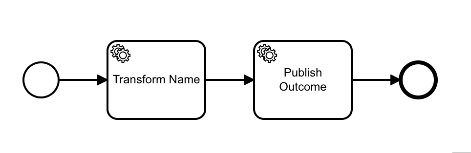
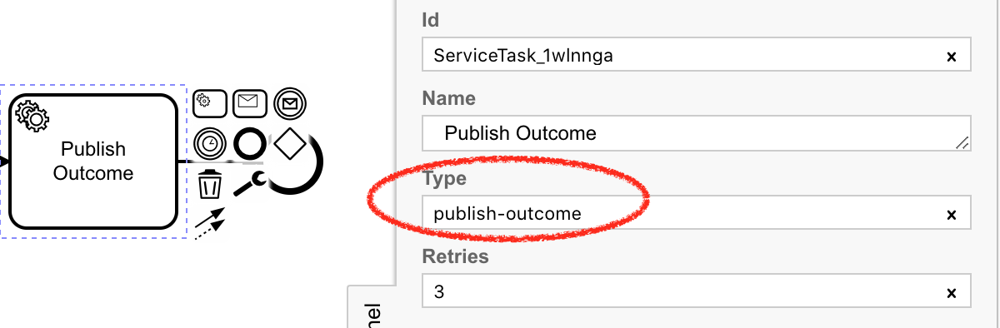

# Zeebe Node Affinity 

This is a server and an enhanced Zeebe Node client (extending [zeebe-node](https://github.com/creditsenseau/zeebe-client-node-js)) to enable you to return the outcome of a Zeebe workflow in a synchronous REST req/res pattern.

It's a Proof-of-Concept, and not intended for production use without further testing.

You may initiate a workflow in Zeebe in response to a REST request, and want to return the outcome of that workflow in the REST response. If your REST front-end is scalable, you need some kind of session affinity.

## Install

To install to your project:

```
npm i zeebe-node-affinity
```

## Usage

Zeebe Node Affinity uses a websocket server to distribute workflow outcomes to interested clients. The `zeebe-node-affinity` library provides the `createWorkflowWithAffinity` method that extends the `createWorkflow` method with a callback. This callback is executed in-memory with the final variable state of the workflow. It can be used like this:

```typescript
const { ZBAffinityClient } = require("zeebe-node-affinity");

const zbc = new ZBAffinityClient("zeebe-broker:26500", {
    affinityServiceUrl: "ws://zeebe-affinity-server:8080"
});

async function handleRequest(req, res) {
    const wfi =  await zbc.createWorkflowInstanceWithAffinity({
        bpmnProcessId: req.route,
        variables: req.params,
        cb: ({ variables }) => res.send(variables) // <- this callback gets the workflow outcome
    }).catch(err => {
        console.error(err.stack)
        res.status(500).send("Something broke!")
    });
    console.log(`Created new workflow instance ${wfi.key}`);
}
```

The programming model in your REST server is a simple callback. This is invoked over web-sockets by a Zeebe Affinity server. Creating a Zeebe Affinity Server is easy:

```typescript
const { ZBAffinityServer } = require("zeebe-node-affinity");

const zbsPort = 8080;
const zbs = new ZBAffinityServer({ logLevel: "INFO" });

zbs.listen(zbsPort, () =>
  console.log(`Zeebe Affinity Server listening on port ${zbsPort}`)
);

setInterval(() => zbs.outputStats(), 1000 * 60 * 5); // 5 minutes
```

This server needs to run on the same network as the REST server front-end and the Zeebe workers.

To communicate the outcome of the workflow to the Zeebe Affinity Server, you need to put a task as the last task in your workflow, and create a Zeebe Affinity worker to service it:



The task-type that you pass to the Affinity Worker constructor should match the task-type of the final task:



Here is the worker code:

```typescript
const { ZBAffinityClient } = require("zeebe-node-affinity");

const zbc = new ZBAffinityClient("zeebe-broker:26500", {
    affinityServiceUrl: "ws://zeebe-affinity-server:8080",
    affinityTimeout: 5000;
});

const afw = zbc.createAffinityWorker("publish-outcome")
                .catch(e => console.log("Could not contact Affinity Server!"));
```

The Affinity Worker will now service this task-type, and communicate the workflow state to the Affinity Server, which sends it to all connected clients, where it is matched against the workflow instance key to invoke the handler on the appropriate client.

We throw in the constructor if we cannot contact the affinity server within `affinityTimeout` milliseconds. We don't want the worker completing jobs if it cannot communicate the results to the Affinity Server.

Similarly, the worker will fail jobs that it takes where it cannot communicate the outcome to an Affinity Server. This will cause an incident to be raised if the connection is not re-established.

## Scaling

The Zeebe Workflow Clients (which initiate workflows), and the Zeebe Affinity Workers (which collect the workflow outcomes) can be scaled.

In this Proof-of-Concept implementation, the Zeebe Affinity Service, however, must be a singleton, and cannot be load-balanced or scaled.

## Demo

You can run a demo in the `demo`  directory. You will need three terminals.

### Setup:
- Git clone this repo
- Run `npm i`

### Terminal 1
Start a Zeebe broker:

```
docker run -it --name zeebe -p 26500:26500 camunda/zeebe:0.20.0
```

### Terminal 2
Start the Affinity Server:

```
cd demo
node affinity-server.js
```

### Terminal 3
Start the Affinity Worker:

```
cd demo
node affinity-worker.js
```

### Terminal 4
Start the demo workers / REST Server / REST Client:

```
cd demo
node index.js
```

## Using in your code

You can install this from npm:

```
npm i zeebe-node-affinity
```

And use it in place / alongside the standard Node client. You will need to host the Affinity Server on your network for it to be of any use. Docker image coming soon.

## TODO

Dockerfile for the Affinity Server.
